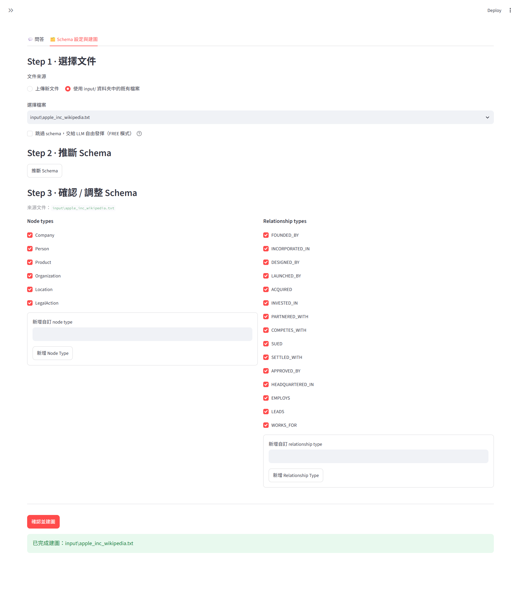
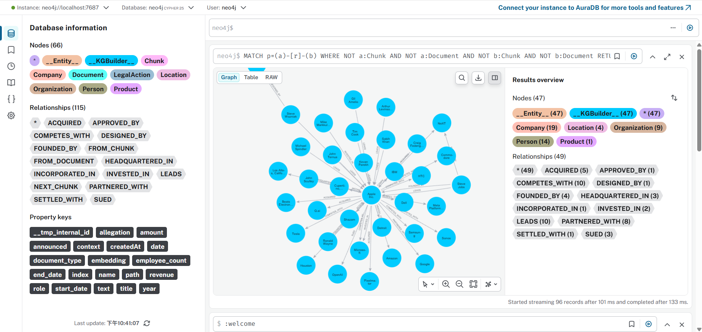
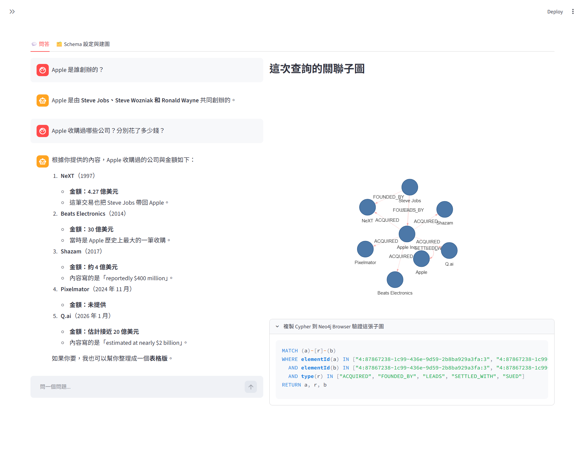
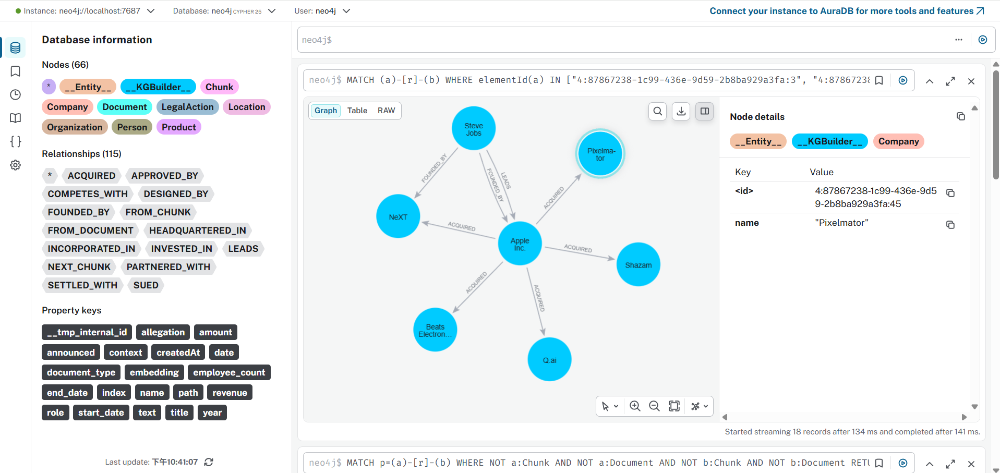

# Neo4j GraphRAG Studio

An interactive Streamlit application built on top of [`neo4j-graphrag`](https://github.com/neo4j/neo4j-graphrag-python) — turn unstructured documents (PDF/TXT/MD) into a Neo4j knowledge graph, then ask questions against it with GraphRAG.

`neo4j-graphrag` provides the building blocks (`SimpleKGPipeline`, `VectorCypherRetriever`, `GraphRAG`, schema extraction). This project wraps them into an end-to-end workflow with a UI: dynamic schema inference + human-in-the-loop confirmation, a chat interface, subgraph visualization scoped to the actual answer, and one-click Cypher for verifying what you see against the database directly.

## Features

- **Dynamic schema inference** — instead of hand-writing a graph schema up front, the app reads your document and proposes node/relationship types with an LLM. You review and adjust the proposal (add/remove types) before anything is written to the graph.
- **GraphRAG Q&A** — combines vector similarity search (find relevant chunks) with 1–2 hop graph traversal (pull in connected entities/relationships), so answers aren't limited to what's in a single retrieved text chunk.
- **Answer-scoped subgraph visualization** — the graph panel only shows entities/relationships that are actually referenced in the answer, not the entire local neighborhood of the retrieved chunk (which can be large and noisy).
- **Cypher verification** — every answer comes with a ready-to-paste Cypher query so you can confirm the visualized subgraph against Neo4j Browser directly.
- **FREE mode** — skip schema guidance entirely and let the LLM extract whatever it finds, for quick exploration.

## Screenshots

Built from the sample Apple document included in `input/`.

**Schema inference — LLM proposes node/relationship types, you confirm before anything is written:**



**Resulting knowledge graph** (66 nodes / 115 relationships from a single article — founders, executives, products, competitors, acquisitions, legal history):



**GraphRAG Q&A** — the subgraph panel and Cypher verification snippet are scoped to what's actually in the answer, not the entire retrieved neighborhood:



**Drilling into a subgraph** (Apple's acquisitions — NeXT, Shazam, Beats Electronics, Q.ai, Pixelmator):



## Architecture

| File | Responsibility |
|---|---|
| `common.py` | Neo4j driver + LLM/embedding client construction, shared config |
| `Ingest.py` | Document → knowledge graph pipeline (`SimpleKGPipeline`) |
| `query.py` | GraphRAG retrieval, answer-scoped subgraph filtering, Cypher generation |
| `app.py` | Streamlit UI (schema tab + chat tab) |

## Setup

### 1. Neo4j

Run Neo4j locally via Docker (APOC plugin included):

```bash
docker run -d --name neo4j-graphrag-studio \
  -p 7474:7474 -p 7687:7687 \
  -v neo4j_data:/data \
  -e NEO4J_AUTH=neo4j/password123 \
  -e NEO4J_PLUGINS='["apoc"]' \
  neo4j:latest
```

### 2. Python environment

Requires Python 3.12+ and [uv](https://docs.astral.sh/uv/).

```bash
uv sync
```

### 3. Configure LLM access

```bash
cp .env.example .env
```

Fill in `.env`:
- `LLM_API_KEY` — required.
- `LLM_BASE_URL` — leave empty to use the official OpenAI API, or point it at any OpenAI-compatible endpoint (Azure AI Foundry's `v1` endpoint, a self-hosted gateway, etc.).
- `CHAT_MODEL` / `EMBEDDING_MODEL` / `EMBEDDING_DIM` — match whatever models your endpoint serves.

### 4. Run

```bash
uv run streamlit run app.py
```

Sample documents (Tesla, Apple — sourced from Wikipedia, CC BY-SA 4.0) are included under `input/` so you can try the schema-inference flow immediately.

## CLI usage

Both the ingestion and query steps also work standalone:

```bash
uv run python Ingest.py                       # ingest everything in input/ using the default schema
uv run python query.py "who are Tesla's main competitors?"
```

## License

MIT — see [LICENSE](LICENSE). Sample data under `input/` is sourced from Wikipedia (CC BY-SA 4.0).

`neo4j-graphrag`, `neo4j` (driver), and `streamlit` are Apache-2.0. `streamlit-agraph` is MIT. All are used as ordinary pip dependencies, not vendored.
